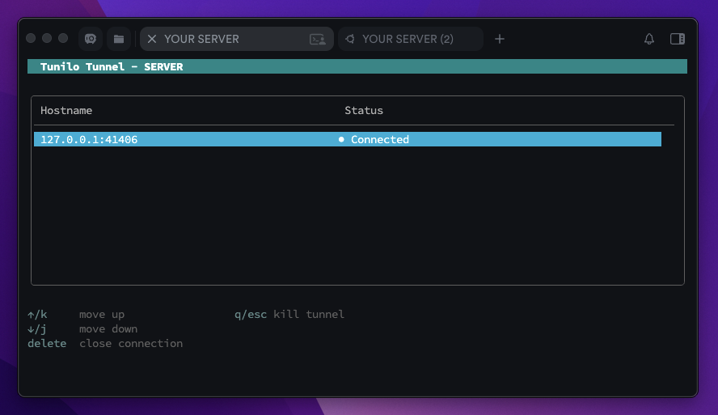

## 📡 Tunilo — Simple, Extremely Fast Reverse HTTP Tunnel for Exposing Local Services


Tunio is a lightweight **Reverse Tunnel** that lets you expose a local HTTP service to the public internet through a TCP control channel.

It works similarly to ngrok, cloudflare tunnel, and localtunnel, but is intentionally minimal and easy to extend, the difference this project makes besides minimalism is that the public facing server is yours, basically making it a **self-hosted reverse-tunnel**.

> [!IMPORTANT]
> This project is only for personal usage and might contain unstable behaviour, please do not use it in a production environment.





## Usage
Tunilo supports both TLS and insecure connections, here's a step by step guide about running the tunnel

1. Download the latest binaries for your operating system from the [Releases]()


2. Once downloaded, run ``chmod +x ./tunilo-server-binary`` and run the tunilo-server at your public server
```python
./tunilo-server-binary --insecure --password 12345 \
                       --control 0.0.0.0:9090 \
                       --public 0.0.0.0:4311
```
> [!NOTE]
> ``--public``: the address that your users are going to request to reach your own http server

----------------
### TLS
If you want to use **TLS** you have to issue a certificate using any service you want, currently we are using **Let's Encrypt**``/``**Certbot**
```
sudo certbot certonly --standalone -d yourdomain.com
```
Now, you got a certificate and a key located at
```
/etc/letsencrypt/live/yourdomain.com/fullchain.pem
/etc/letsencrypt/live/yourdomain.com/privkey.pem
```

Start the server using:
```python
./tunilo-server-binary --control 0.0.0.0:9090 \
                       --public 0.0.0.0:4311 \
                       --password 12345 \
                       --cert /etc/letsencrypt/live/yourdomain.com/fullchain.pem \
                       --key /etc/letsencrypt/live/yourdomain.com/privkey.pem 
```
----------------

3. Now, in your client/local-machine open the client binary to connect to the server
```python
./tunilo-client-binary --insecure --password 12345 \
                       --control remote-server-address:9090 \
                       --forward localhost:8080
```

> [!NOTE]
> - ``--forward``: the address owned by your own HTTP server ( backend, blog, personal project,... )
> - ``--control``: is the your remote-server-address:control-port which is provided by the flags set in server binary

4. Enjoy ✌️

> [!WARNING]
> Please make sure you are using the secure TLS version if you are using an untrusted network.

## Flags 
### Server Flags:
| Flag     	        | Default Value 	    | Description                                                                  	|
|-------------------|-----------------------|------------------------------------------------------------------------------	|
| ``--control``  	| ``0.0.0.0:9090``  	| Address the control server listens on (host:port)                            	|
| ``--public``   	| ``0.0.0.0:4311``  	| Address the public server listens on (host:port)                             	|
| ``--insecure`` 	| ``false``         	| Disable TLS and allow insecure connections                                   	|
| ``--cert``     	| `` ``             	| Path to the TLS certificate file (required when TLS is enabled)              	|
| ``--key``      	| `` ``              	| Path to the TLS private key file (required when TLS is enabled)              	|
| ``--password`` 	| ``12345``         	| Password used for client authentication                                      	|
| ``--notui``    	| ``false``         	| Disable the interactive TUI (useful for automation or headless environments) 	|


### Client Flags:
| Flag         	| Default Value    	| Description                                                                  	|
|--------------	|------------------	|------------------------------------------------------------------------------	|
| ``--control``  	| ``0.0.0.0:9090`` 	| Password used to authenticate with the control server                        	|
| ``--forward``  	| ``0.0.0.0:8999`` 	| Local address to forward traffic to                                          	|
| ``--insecure`` 	| ``false``        	| Connect to the server without TLS                                            	|
| ``--password`` 	| ``12345``        	| Password used for client authentication                                      	|
| ``--notui``    	| ``false``        	| Disable the interactive TUI (useful for automation or headless environments) 	|

## Tunilo Protocol
You can read more in [protocol.md](/protocol.md)

## Contributing
Pull requests are welcome. For major changes, please open an issue first
to discuss what you would like to change.

## License
All the code is licensed under [MIT](/LICENSE)
